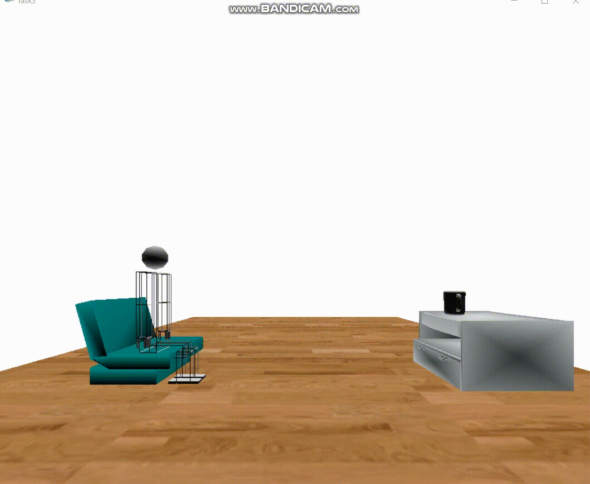
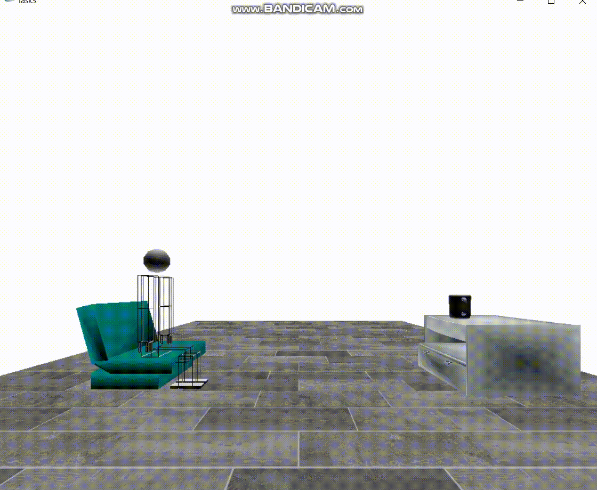
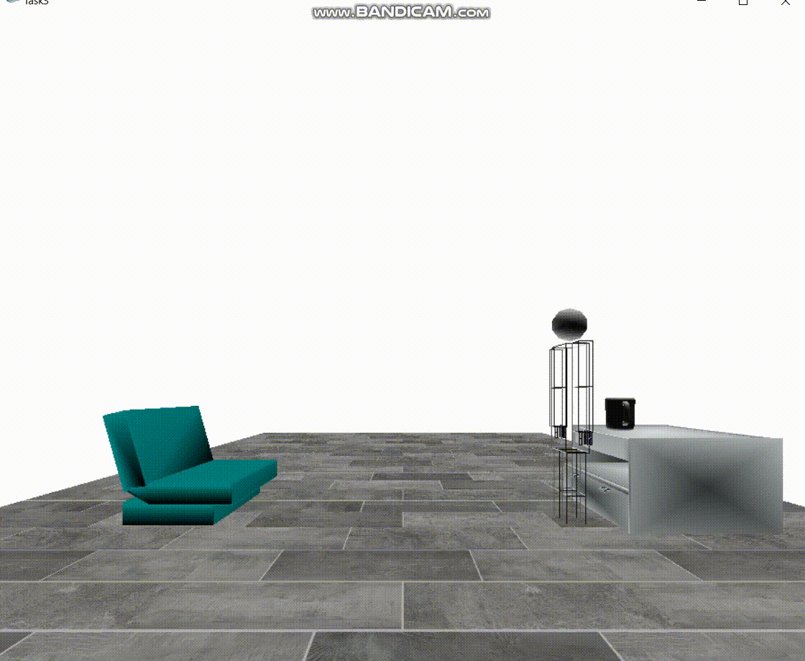
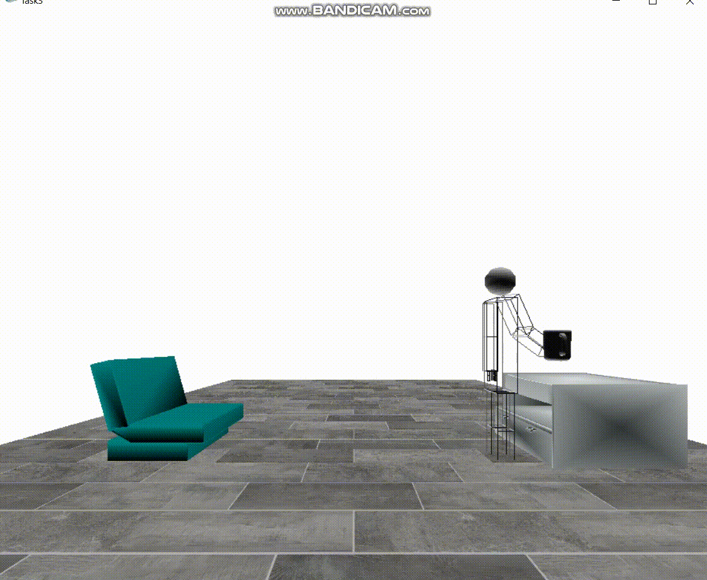

# Assignment 3 : Animation, Texture mapping and Loading objects

Team members: 

### Ahmed Hesham - 1 - 8
### Asmaa Ibrahim - 1 - 12 
### Alaa Moselhy - 1 - 13
### Elijah - 1 - 14

---

> summary of our implementations :

### - first we draw a floor and then using texture mapping we added 3 different textures to the floor, and by clicking right mouse button we can change between them.

### - then we loaded our robot that we implemented in task 2, also we loaded a sofa, table and mug so the robot will move from the sofa to the table to take his coffee.

### - Finally we made some animation functions to make the robot jump and make it interact with the mug.

